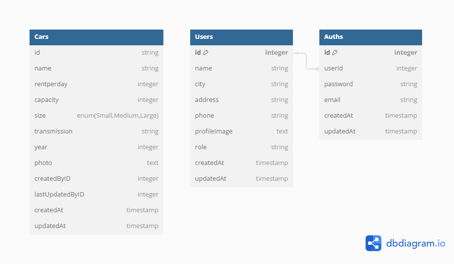

<h1 align="center">
   
  
   
   
  Dailytask Chapter 6 React and Fetch API [Multirepo Structure]
   
</h1>

<h4 align="center">A Fullstack Dashboard for Binar Academy designed to manage car data and a car rental website utilizing <a href="https://expressjs.com/" target="_blank">Express.js</a> as the backend and Postgress as the Database Management System (DBMS). Creating The UI with React.js</h4>

  <a href="#express">express</a> •
  <a href="#postman">postman</a> •
  <a href="#sequelize">sequelize</a> •
  <a href="#javascript">javascript</a> •
  <a href="#nodejs">nodejs</a> •
  <a href="#postgress">postgress</a> •
  <a href="#react">react</a>

## Database Structure

## KM x Binar Academy Batch 6

### Data Peserta

|                |                      |
| -------------- | -------------------- |
| Nama Peserta   | Muhammad Rizki       |
| Kelas          | FSW 1                |
| Fasilitator    | Imam Taufiq Hermawan |
| ID Fasilitator | F-FSW24001086        |
|                |                      |

# React + Vite

This template provides a minimal setup to get React working in Vite with HMR and some ESLint rules.

Currently, two official plugins are available:

- [@vitejs/plugin-react](https://github.com/vitejs/vite-plugin-react/blob/main/packages/plugin-react/README.md) uses [Babel](https://babeljs.io/) for Fast Refresh
- [@vitejs/plugin-react-swc](https://github.com/vitejs/vite-plugin-react-swc) uses [SWC](https://swc.rs/) for Fast Refresh

| Dailytask                                 |
| ----------------------------------------- |
| ch6-dailytask-fetch-api                   |
| [GOLD🥇] Chapter 6 - Fetch API with React |
